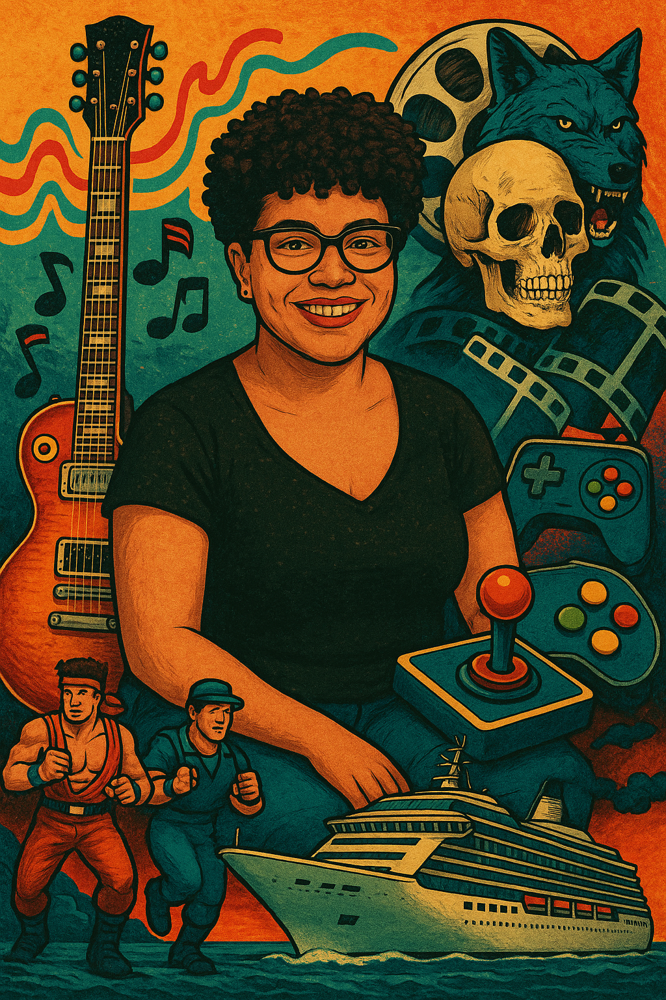
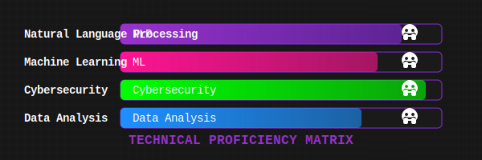

  

  

  

  
  
  

## 🧠 Research & Technical Focus

As a Chevening Scholar pursuing an MSc in Artificial Intelligence, I specialize in:

- **Natural Language Processing** — Advanced text analysis with transformers & bias mitigation
- **Data Privacy & Protection** — Securing sensitive information in AI systems
- **Cybersecurity Intelligence** — ML-driven threat detection & vulnerability assessment
- **Algorithmic Fairness** — Ensuring equitable outcomes for marginalized communities

My research bridges technical implementation with critical social impact, particularly focusing on how AI systems can both perpetuate and mitigate bias across intersectional identities.

  

## 🛠️ Technical Arsenal

  
  
  
  
  
  
  
  
  

## 📚 Education

- **MSc in Artificial Intelligence and its Applications** — University of Essex _(Chevening Scholar)_
- **MA in Cultural Studies (Transatlantic Studies)** — Jagiellonian University
- **BA in International Relations** — Federal University of Santa Catarina
- **Certificate in Data Privacy and Technology** — Harvard Online

## 🎭 The Dark Aesthete: Beyond Code 💀

  
<b>Click to explore my world outside technology</b>

### 🎬 Cinematic Universe

- **Film Noir & Golden Age** — Screwball comedies and shadowy narratives
- **Horror Aficionado** — Vincent Price classics and 80s cult films
- **Thematic Fascinations** — Time loops, identity shifts, justified vengeance

### 🎧 Sonic Landscapes

- **Core Resonance** — Grunge (Alice in Chains), Progressive Rock (Porcupine Tree), Doom Metal
- **Cultural Roots** — Brazilian rhythms, Jazz explorations, Soul classics

### ✒️ Literary & Creative Pursuits

My writing explores intersectionality, identity formation, and digital anthropology through a feminist lens.

### 🌍 Global Citizen

- **Languages** — Portuguese (native), English (fluent), French, Polish, Spanish (working proficiency)
- **Cultural Immersion** — International work and study across Brazil, Poland, and the UK

## 🔭 Current Research Directions

I'm currently investigating:

- **Bias detection in recommender systems** — Focusing on tagging systems and content classification
- **Fairness metrics for NLP models** — Developing refined evaluation frameworks
- **Secure federated learning** — Privacy-preserving methods for distributed model training

Seeking collaborations at the intersection of AI ethics, cybersecurity, and social impact.

---

  <picture>
    <source media="(prefers-color-scheme: dark)" srcset="https://raw.githubusercontent.com/louiseluli/louiseluli/output/github-contribution-grid-snake-dark.svg">
    <source media="(prefers-color-scheme: light)" srcset="https://raw.githubusercontent.com/louiseluli/louiseluli/output/github-contribution-grid-snake.svg">
    
  </picture>

