<!-- Header Banner -->

  <!-- Static fallback image for GitHub README -->
  <a href="https://louiseluli.github.io/louisesfer/" target="_blank">
    
     
    <i>👆 Click for animated banner</i>
  </a>

<!-- Profile Image -->

  

## Louise Ferreira (Luli)

    <b>Artificial Intelligence Researcher | Machine Learning Specialist | Cybersecurity Professional</b>
     
    <i>Transforming technical innovation into equitable AI systems at the intersection of NLP, fairness, and privacy</i>

### Technical Expertise

- **Machine Learning & AI**: Transformer architectures, fairness-aware NLP, recommender systems, BERT/RoBERTa fine-tuning
- **Algorithm Development**: Bias detection/mitigation, explainable AI (SHAP, LIME), clustering algorithms (K-means, SVD)
- **Technical Stack**: Python, PyTorch, HuggingFace, Scikit-learn, Pandas, Fairlearn, AIF360
- **Cybersecurity**: Data Loss Prevention (DLP), privacy engineering, open-source intelligence (OSINT)

### Research Focus

My research bridges algorithmic fairness with practical implementation, focusing on:

- Fairness assessment frameworks for transformer-based NLP systems
- Bias detection and mitigation in content classification and recommendation
- Privacy-preserving machine learning with intersectional fairness guarantees
- Autoethnographically-informed approaches to algorithmic justice and representation

### Education & Recognition

- **MSc Artificial Intelligence and its Applications**, University of Essex (Chevening Scholar)
- **MA Cultural Studies**, Jagiellonian University
- **BA International Relations**, Federal University of Santa Catarina

### Publications & Projects

- Coming soon...

### Technical Proficiency

### Connect

  
  

  <i>Bringing together technical excellence, lived experience, and interdisciplinary perspectives to create more equitable and representative AI systems</i>

