<!-- Header Section with Main Banner -->
<div align="center">
  
</div>

<div align="center" style="margin-top: 20px; margin-bottom: 20px;">
  
</div>

<div align="center" style="margin-bottom: 30px;">
  
</div>

<p align="center" style="margin-bottom: 30px;">
  <a href="mailto:silvaferreiralouise@gmail.com">
    
  </a>
  <a href="https://www.linkedin.com/in/louisesfer/">
    
  </a>
</p>

## 🧠 Research & Technical Focus

As a **Chevening Scholar** pursuing an MSc in Artificial Intelligence, my research synthesizes cutting-edge machine learning methodologies with critical approaches to algorithmic fairness and cybersecurity. My work concentrates on:

- **Advanced Natural Language Processing:** Leveraging transformer architectures and attention mechanisms for robust text analysis, with particular emphasis on **bias detection and mitigation** in embeddings and classification systems.
- **Algorithmic Fairness & Ethics:** Developing frameworks that promote equitable outcomes across intersectional identities through fairness-aware algorithms and debiasing techniques.
- **Cybersecurity Intelligence:** Implementing machine learning for advanced threat detection, anomaly identification, and security vulnerability assessment through predictive modeling and pattern recognition.
- **Privacy-Preserving Machine Learning:** Engineering techniques for secure model training while protecting sensitive data through federated learning, differential privacy, and secure multi-party computation.

My research bridges rigorous technical implementation with nuanced understanding of social dynamics, focusing on how AI systems can be engineered to counteract bias in high-stakes contexts.

<div align="center" style="margin-top: 25px; margin-bottom: 25px;">
  
</div>

## 🛠️ Technical Expertise

My technical arsenal encompasses state-of-the-art machine learning frameworks and methodologies:

<p align="center" style="margin-top:15px; margin-bottom:15px;">
  
  
  
  
  
  
  
  
</p>

## 📊 Machine Learning Methodologies

```python
# Sample code demonstrating my technical approach to fairness-aware NLP
import torch
from transformers import AutoTokenizer, AutoModel
from fairlearn.metrics import demographic_parity_difference

# Load pre-trained model with attention mechanism
tokenizer = AutoTokenizer.from_pretrained("distilbert-base-uncased")
model = AutoModel.from_pretrained("distilbert-base-uncased")

# Implement bias mitigation through adversarial debiasing
class AdversarialDebiasing(torch.nn.Module):
    def __init__(self, base_model, protected_attribute_size):
        super().__init__()
        self.base_model = base_model
        self.task_head = torch.nn.Linear(768, 1)
        self.adversary = torch.nn.Sequential(
            torch.nn.Linear(768, 256),
            torch.nn.ReLU(),
            torch.nn.Linear(256, protected_attribute_size)
        )

    def forward(self, input_ids, attention_mask):
        embeddings = self.base_model(input_ids, attention_mask).last_hidden_state[:, 0, :]
        task_pred = self.task_head(embeddings)
        protected_pred = self.adversary(embeddings.detach())
        return task_pred, protected_pred
```

## 📚 Academic Background

My interdisciplinary academic journey reflects my commitment to integrating technical excellence with ethical considerations:

- **MSc in Artificial Intelligence and its Applications** – University of Essex _(Chevening Scholar)_
- **MA in Cultural Studies (Transatlantic Studies)** – Jagiellonian University, Kraków
- **BA in International Relations** – Federal University of Santa Catarina, Brazil
- **Certificate in Data Privacy and Technology** – Harvard University (Online)

## 🎭 Beyond the Algorithm: Creative Dimensions

While my professional focus centers on AI systems and computational methodologies, my intellectual curiosity extends to the rich tapestry of human expression. These diverse interests fundamentally inform my perspective on technology's role in society.

<details style="margin-top: 10px; margin-bottom:25px; background-color: #23272E; border-radius: 8px; padding: 15px; border: 1px solid #30363D;">
  <summary style="font-weight: bold; color: #BB86FC; cursor: pointer;">Click to explore my world of inspirations...</summary>

  <div style="margin-top: 15px;">
    <h4 style="color: #E91E63; border-bottom: 1px solid #E91E6330; padding-bottom: 5px;">🎬 Cinematic Universe: Narratives of Intrigue & Shadow</h4>
    <ul style="color: #C5C5C5; list-style-type: '🎞️ '; padding-left: 20px;">
      <li>**Film Noir & Golden Age Classics:** The sharp wit of screwball comedies and the complex morality of noir.</li>
      <li>**Horror Aficionado:** Reverence for Vincent Price's iconic roles and the visceral energy of 80s cult cinema (e.g., *The Evil Dead*).</li>
      <li>**Thematic Fascinations:** Intricate plots involving time loops, mistaken identities, and meticulously justified vengeance.</li>
    </ul>

    <h4 style="color: #BB86FC; border-bottom: 1px solid #BB86FC30; padding-bottom: 5px; margin-top:20px;">🎧 Sonic Landscapes: From Grunge Catharsis to Progressive Journeys</h4>
    <ul style="color: #C5C5C5; list-style-type: '🎶 '; padding-left: 20px;">
      <li>**Core Resonance:** The raw emotion of Grunge (Alice in Chains), the intricate storytelling of Progressive Rock (Porcupine Tree, Tool), and the atmospheric depths of Doom Metal.</li>
      <li>**Cultural & Eclectic Echoes:** The vibrant rhythms of Brazilian music, the improvisational spirit of Jazz, and the timeless appeal of Soul classics.</li>
    </ul>

    <h4 style="color: #00BCD4; border-bottom: 1px solid #00BCD430; padding-bottom: 5px; margin-top:20px;">✒️ Literary & Creative Pursuits: Intersectional Narratives</h4>
    <p style="color: #C5C5C5;">My writing delves into themes of intersectionality, identity formation, and digital anthropology, often through a critical feminist lens and with a passion for autoethnography.</p>

    <h4 style="color: #00E676; border-bottom: 1px solid #00E67630; padding-bottom: 5px; margin-top:20px;">🌐 Global Perspectives & Cultural Fluency</h4>
    <ul style="color: #C5C5C5; list-style-type: '🌍 '; padding-left: 20px;">
      <li>**Languages:** Portuguese (Native), English (Fluent), French, Polish, Spanish (Working Proficiency).</li>
      <li>**Cultural Immersion:** Enriched by professional work and academic study across diverse cultural landscapes including Brazil, Poland, and the United Kingdom.</li>
    </ul>

  </div>
</details>

## 🔬 Current Research Trajectories

I am actively investigating and seeking collaborations in the following areas:

- **Deep Learning for Algorithmic Bias Detection:** Developing novel architectures to identify and mitigate bias in classification and recommendation systems, with particular focus on tagging mechanisms that affect content discoverability.

- **Interpretability in Large Language Models:** Exploring methods to enhance model transparency through attention visualization, influence functions, and counterfactual explanation generation for high-stakes NLP applications.

- **Cybersecurity-Enhanced Federated Learning:** Investigating privacy-preserving machine learning methodologies that maintain model performance while protecting sensitive training data through secure aggregation protocols.

- **Fairness Metrics Beyond Accuracy:** Formulating evaluation frameworks that capture nuanced fairness considerations across intersectional dimensions, particularly in contexts where marginalized communities face disproportionate risks.

I welcome connections with researchers, industry professionals, and organizations dedicated to advancing ethical AI, enhancing cybersecurity, and developing technology with justice and equity at its core.

---

<!-- Custom SVG for Machine Learning Animation -->
<div align="center">
  <svg width="600" height="100" xmlns="http://www.w3.org/2000/svg">
    <style>
      .small-caps { font-variant: small-caps; }
      @keyframes pulse {
        0% { opacity: 0.6; }
        50% { opacity: 1; }
        100% { opacity: 0.6; }
      }
      .pulse {
        animation: pulse 3s infinite ease-in-out;
      }
    </style>
    <rect width="100%" height="100%" fill="#1A1D23" rx="10" ry="10" />
    <text x="300" y="38" font-family="'Segoe UI', Tahoma, Geneva, Verdana, sans-serif" font-size="16" fill="#BB86FC" text-anchor="middle" class="small-caps pulse">Machine Learning • Ethics • Cybersecurity</text>
    <line x1="150" y1="50" x2="450" y2="50" stroke="#E91E63" stroke-width="1" stroke-dasharray="5,5" />
    <text x="300" y="75" font-family="'Courier New', monospace" font-size="14" fill="#00BCD4" text-anchor="middle" class="pulse">Building equitable AI systems through rigorous technical innovation</text>
  </svg>
</div>
