<!-- Header Banner -->

  <!-- Static fallback image for GitHub README -->
  <a href="https://louiseluli.github.io/louisesfer/" target="_blank">
    
     
    <i>👆 Click for animated banner</i>
  </a>

<!-- Profile Image -->

  

## Louise Ferreira (Luli)

    <b>Artificial Intelligence Researcher | Machine Learning Specialist | Cybersecurity Professional</b>
     
    <i>Transforming technical innovation into equitable AI systems at the intersection of NLP, fairness, and privacy</i>

### Technical Expertise

- **Machine Learning & AI**: Transformer architectures, fairness-aware NLP, recommender systems, BERT/RoBERTa fine-tuning
- **Algorithm Development**: Bias detection/mitigation, explainable AI (SHAP, LIME), clustering algorithms (K-means, SVD)
- **Technical Stack**: Python, PyTorch, HuggingFace, Scikit-learn, Pandas, Fairlearn, AIF360
- **Cybersecurity**: Data Loss Prevention (DLP), privacy engineering, open-source intelligence (OSINT)

  

<h2 align="center">Research Areas</h2>

<table>
  <tr>
    <td align="center" width="33%">
      
      <h3>Fairness-Aware NLP</h3>
      
Developing transformer-based systems with built-in bias detection and mitigation.

    </td>
    <td align="center" width="33%">
      
      <h3>Intersectional AI Ethics</h3>
      
Creating models that account for overlapping dimensions of identity in data representation.

    </td>
    <td align="center" width="33%">
      
      <h3>Privacy-Preserving ML</h3>
      
Developing techniques that maintain data privacy while ensuring algorithmic fairness.

    </td>
  </tr>
</table>

<h3 align="center">Academic Journey</h3>

  <table>
    <tr>
      <td align="right" width="45%"><b>2024-2025</b></td>
      <td width="10%">➤</td>
      <td align="left" width="45%"><b>MSc in AI and its Applications</b> University of Essex <i>Chevening Scholar</i></td>
    </tr>
    <tr><td colspan="3">
⋮
</td></tr>
    <tr>
      <td align="right" width="45%"><b>2014-2016</b></td>
      <td width="10%">➤</td>
      <td align="left" width="45%"><b>MA in Cultural Studies</b> Jagiellonian University <i>Transatlantic Studies</i></td>
    </tr>
    <tr><td colspan="3">
⋮
</td></tr>
    <tr>
      <td align="right" width="45%"><b>2009-2013</b></td>
      <td width="10%">➤</td>
      <td align="left" width="45%"><b>BA in International Relations</b> Federal University of Santa Catarina</td>
    </tr>
  </table>

<h2 align="center">Research & Publications</h2>

<table>
<tr>
  <td>
<!-- Intersectional Approaches to AI Safety -->
<h4>Intersectional Approaches to AI Safety</h4>

  A framework for evaluating safety systems across multiple dimensions of identity 
  <em>Expected: Winter 2025</em>

<!-- Final Dissertation (2025) -->
<h4>Final Dissertation (2025)</h4>
<ul>
  <li><strong>Topic:</strong> Detecting and Mitigating Algorithmic Bias in ML Models Categorizing Adult Content Metadata</li>
  <li><strong>Focus:</strong> Black women and intersectional identities (e.g., BBW, Trans, Interracial)</li>
  <li><strong>Dataset:</strong> 134,350 videos, categorized (asian, latina, interracial, ebony, bbw, brazilian, indian, arab, transgender)</li>
  <li><strong>Metadata Fields:</strong> Tags, views, ratings, duration, category labels</li>
  <li><strong>Techniques &amp; Models:</strong>
    <ul>
      <li>Descriptive statistics on metadata and tag frequency</li>
      <li>Bias and fairness analysis across groups</li>
      <li>Fairness metrics (e.g., Equal Opportunity, Demographic Parity)</li>
      <li>Text classification, unsupervised clustering, counterfactual data augmentation</li>
    </ul>
  </li>
</ul>

<!-- Text Analytics -->
<h4>Text Analytics</h4>
<ul>
  <li><strong>Project:</strong> Sentiment Analysis on Amazon Reviews (NLP)</li>
  <li><strong>Models Used:</strong>
    <ul>
      <li>VADER – rule-based sentiment analysis</li>
      <li>DistilBERT – transformer-based classification</li>
      <li>RoBERTa – advanced transformer for nuanced detection</li>
      <li>Logistic Regression – baseline supervised model</li>
    </ul>
  </li>
  <li><strong>Tasks:</strong>
    <ul>
      <li>Text preprocessing (tokenization, lemmatization, stopword removal)</li>
      <li>Evaluation on unbalanced data (precision, recall, F1, confusion matrix)</li>
      <li>Comparison of unsupervised, supervised, and transformer-based models</li>
    </ul>
  </li>
</ul>

<!-- Information Retrieval -->
<h4>Information Retrieval </h4>
<ul>
  <li><strong>Project:</strong> Analyzing Denzel Washington's Career</li>
  <li><strong>Tools Used:</strong> Elasticsearch, Kibana</li>
  <li><strong>Methods:</strong>
    <ul>
      <li>Indexing & querying IMDb data</li>
      <li>Search relevance tuning (boosting by tags or roles)</li>
      <li>Visual dashboards of genre, co-stars & critical reception</li>
    </ul>
  </li>
</ul>

<!-- Programming -->
<h4>Programming </h4>
<ul>
  <li><strong>Language:</strong> Python</li>
  <li><strong>Topics:</strong> Basic syntax, loops, functions, data structures, OOP</li>
</ul>

<!-- AI & ML with Applications  -->
<h4>AI &amp; Machine Learning with Applications</h4>
<ul>
  <li><strong>Models &amp; Topics:</strong>
    <ul>
      <li>K-Means Clustering</li>
      <li>SVD (latent factor modelling)</li>
      <li>ANNs for classification & regression</li>
      <li>Hybrid recommender systems</li>
      <li>Evolutionary feature selection</li>
      <li>Imbalanced data metrics (AUC, Precision@K, NDCG)</li>
    </ul>
  </li>
</ul>
  </td>
</tr>
</table>

### Technical Proficiency

### Connect

  
  

  <i>Bringing together technical excellence, lived experience, and interdisciplinary perspectives to create more equitable and representative AI systems</i>

---

#### 🖼 Icon Credits

- [Brain icons created by juicy_fish - Flaticon](https://www.flaticon.com/free-icons/brain)
- [Diversity icons created by Freepik - Flaticon](https://www.flaticon.com/free-icons/diversity)
- [Privacy icons created by Flat Icons - Flaticon](https://www.flaticon.com/free-icons/privacy)
